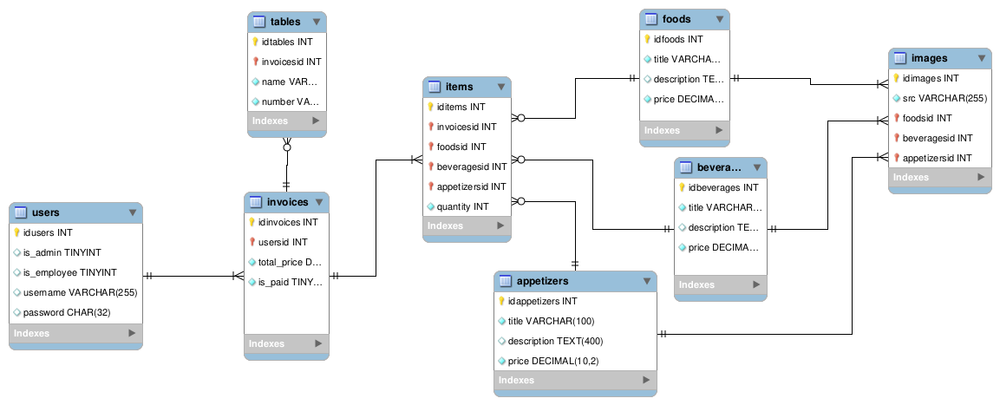

# invorest-api

Invorest, A simple restaurant management system.<br />
This repository contains server codes and completes invorest-app and invorest-dashboard repositories.<br />
Feel free to contribute and add cool features.

ER diagram:<br />
<br />
Also, you can find MySQL Workbench file in models directory just follow these [steps](#how-to-use-mwb-file) to edit. <br />

## How to run project

config/config.json

```
{
  "development": {
    "username": "root",
    "password": "password",
    "database": "invorest_dev",
    "host": "localhost",
    "dialect": "mysql"
  },
  "test": {
    "username": "root",
    "password": "password",
    "database": "invorest_test",
    "host": "localhost",
    "dialect": "mysql"
  },
  "production": {
    "username": "root",
    "password": "password",
    "database": "invorest",
    "host": "localhost",
    "dialect": "mysql"
  }
}
```

## How to use mwb file

Long story short, git does not track mwb file changes. In order to make it work we need to extract it and track its content. after `pulling` changes from repository, you need to run `pack.sh` in `models/diagram` directory to produce latest version of mwb file and run it.<br />
When you are done with your changes in mwb file just run `unpack.sh` in the same directory, then `commit and push`.
([original solution](https://stackoverflow.com/questions/33614759/hg-diff-on-mysql-workbench-files))
